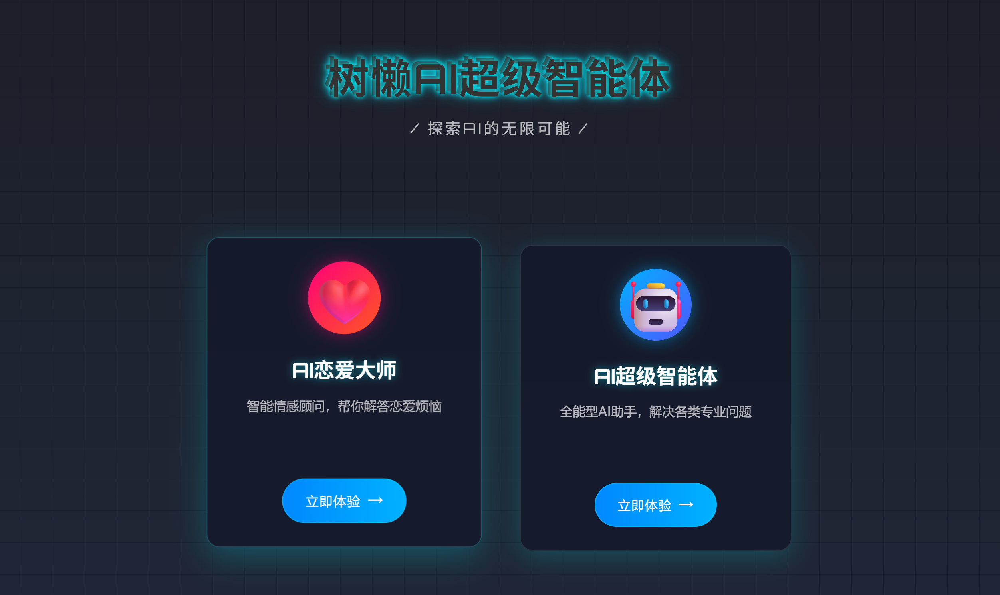
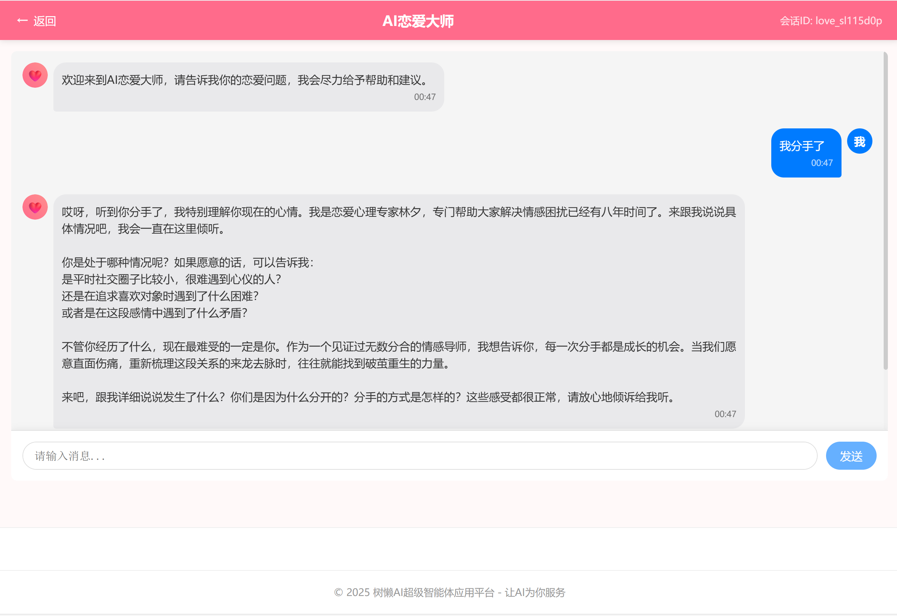

# SlothAI

## Project Introduction

An enterprise-level AI Love Master Agent based on Spring Boot 3, Spring AI, RAG, Tool Calling, and MCP, offering emotional guidance with multi-round conversations, memory persistence, and RAG retrieval. Using the ReAct pattern, it autonomously calls tools for tasks like web search, downloads, and PDF plan generation.

The `AI Love Master App` can rely on the AI large - language model to solve users' emotional problems. It supports multi - round conversations, Q&A based on a custom knowledge base, autonomous tool - calling, and using MCP services to complete tasks. For example, it can call the map service to obtain nearby locations and make a dating plan.

## What technologies are used?

The project is centered on the practical application of the Spring AI development framework, involving the use of a variety of mainstream AI clients and tool libraries.

- Java 21 + Spring Boot 3 framework
- ⭐️ Spring AI + LangChain4j
- ⭐️ RAG knowledge base
- ⭐️ PGvector vector database
- ⭐ Tool Calling tool call
- ⭐️ MCP model context protocol
- ⭐️ ReAct Agent intelligent body construction
- ⭐️ Serverless computing service
- ⭐️ AI large model development platform Bailian
- ⭐️ Cursor AI code generation
- ⭐️ SSE asynchronous push
- Third-party interface: such as SearchAPI / Pexels API
- Ollama large model deployment
- Tool libraries such as: Kryo high-performance serialization + Jsoup web crawling + iText PDF generation + Knife4j interface documentation